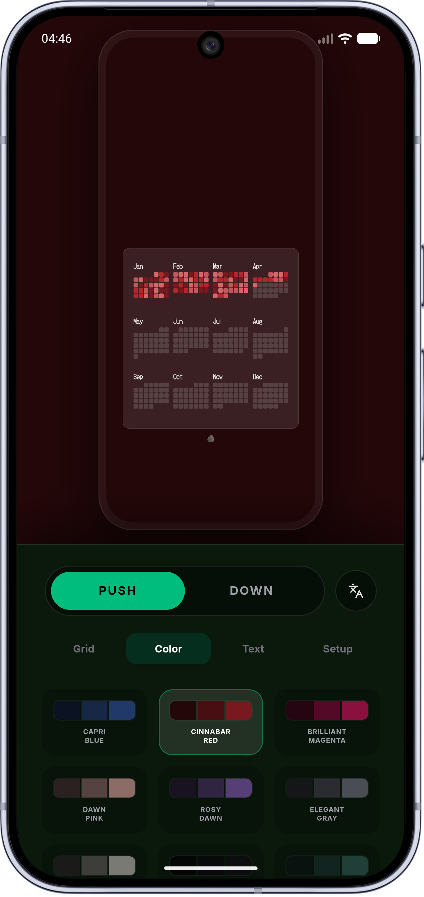
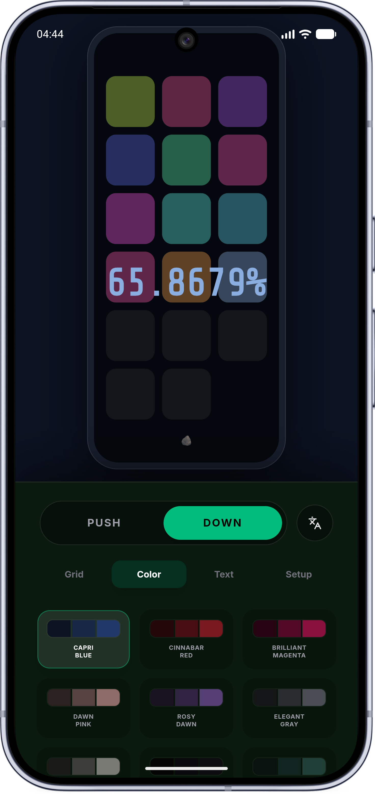
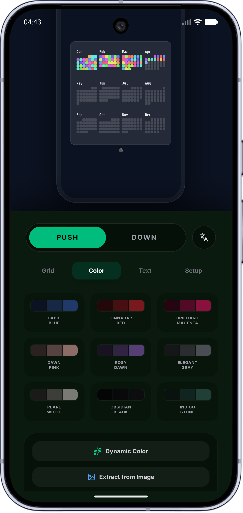

Sisyphus (西西弗斯)
> *"The struggle itself toward the heights is enough to fill a man's heart. One must imagine Sisyphus happy." — Albert Camus*
> 
> *“登上顶峰的斗争本身足以充实人的心灵。应该认为，西西弗是幸福的。” —— 阿尔贝·加缪*

 ## 📸 Screenshots

[English Version](#english-version) | [中文版](#中文版)

## English Version
Pure · Restrained · Undisturbed · Private

Sisyphus is not just a dynamic wallpaper application; it is a philosophical tool designed to visualize your existence. By transforming your time—your past, present, and future—into a minimalist heatmap grid on your screen, it turns the abstract flow of life into tangible, visible traces. Every passing day is a block illuminated, a step forward, much like Sisyphus pushing his boulder up the mountain.

## 🚀 Feature Overview
PUSH: A forward-moving calendar heatmap. Every colored block represents a day you existed and made a trace.

DOWN: A visceral life countdown visualizer. Watch the glowing blocks slowly extinguish against a pure black canvas, putting the limited nature of time into perspective.

## ⬛️ Design Philosophy
The Grid as a Canvas: We stripped away all unnecessary numbers, alerts, and noise. What remains is a pure grid. It serves as an annual heatmap of your life, tracking your progress seamlessly and silently.

Dynamic but Restrained: Built with modern design principles (Material Design 3), the app extracts elegant color palettes directly from your wallpaper. Your daily traces blend organically with your digital environment, rather than disrupting it.

Unconscious Tracking: Once configured, Sisyphus updates your lock screen and wallpaper silently in the background every midnight. No manual check-ins are required. Time simply leaves its mark.

## 🔒 Absolute Privacy & Permissions
Your perception of time belongs solely to you. Sisyphus is built on a foundation of absolute digital restraint:

100% Offline & Zero Telemetry: Sisyphus operates entirely on your local device. It does not collect, store, upload, or transmit any data. We have explicitly purged all internet permissions. There are no ads, no trackers, and no analytics.

Minimal Permissions: We only ask for what is strictly necessary to run the core experience:

- Set Wallpaper: The essential permission to apply the generated heatmap to your screen.

- Run at Startup: Allows the app to seamlessly resume the silent, midnight wallpaper update after a phone reboot.

- Storage (Optional): Only requested if you actively choose to export your heatmap or use a custom image from your gallery.

## 🛠️ The Architecture
While the philosophy is minimalist, the underlying engine is robust. Sisyphus employs an elegant hybrid architecture to deliver both a fluid UI and deep system integration:

React + TailwindCSS: Delivers a fluid, immersive, and highly responsive frontend interface.

Capacitor: Acts as the cross-platform bridge, effortlessly connecting web technologies with Android's native capabilities.

Native Android (Java): Handles the heavy lifting in the background—utilizing WorkManager for battery-friendly midnight redraws and Palette for system-level dynamic color extraction.

## ⚖️ License & Build
This project is licensed under the GNU General Public License v3.0 (GPLv3).
(To build from source: simply run npm run build, followed by npx cap sync, and launch via Android Studio).

One block a day. This is my hill.

## 中文版

纯粹 · 克制 · 无扰 · 隐匿

Sisyphus（西西弗斯） 不仅仅是一款动态壁纸应用，它更像是一个存在主义的数字工具。它将你的时间——过去、现在与未来——具象化为屏幕上极简的像素热力图。抽象的生命刻度在这里化为可见的痕迹，每一天的流逝都会点亮一个方块，就像西西弗斯日复一日地将巨石推向山顶。

## 🚀 功能介绍
推石模式：一种向前推进的日历热力图。每一个彩色方块都代表着你曾存在并留下印记的一天。

荒诞倒数：一种直击心灵的生命倒计时可视化体验。凝视着发光的方块在纯黑的画布上缓缓熄灭，从而真切地体悟到时间的有限本质。

## ⬛️ 设计理念
网格即画布： 我们剥离了所有多余的数字、红点和引发焦虑的倒计时，只留下纯粹的网格。它是你生命轨迹的专属热力图，静默地记录着你的存在。

灵动而克制： 遵循 Material Design 3 规范，应用会自动从你的底图中提取高级、优雅的色板。你每天留下的痕迹，会与你的系统环境完美融合，绝不喧宾夺主。

无感记录： 一旦设定完成，Sisyphus 就会在每天午夜于后台静默刷新你的锁屏与壁纸。无需你刻意打卡，时间自会留下印记。

## 🔒 绝对的隐私与极简权限
你的时间轨迹是绝对私密的数字领地。Sisyphus 的底层逻辑建立在极度的克制之上：

100% 离线与零遥测： 你的所有数据、配置和热力图生成，均在设备本地完成。应用没有申请任何网络权限，没有数据收集，没有崩溃上报，更没有任何第三方商业广告。

最小可用权限： 我们仅申请维持核心运转的最基础权限：

- 设置壁纸： 核心权限，用于将渲染好的热力图应用至桌面或锁屏。

- 开机自启： 确保手机重启后，每日凌晨自动更新壁纸的后台静默任务不会中断。

- 存储读写（可选）： 仅当您主动需要导出热力图，或从相册选择本地图片作为底图时才会调用。

## 🛠️ 优雅的架构
极简的表象之下，是坚实的技术支撑。Sisyphus 采用了轻量且高效的混合架构，兼顾了 UI 的表现力与底层的稳定性：

React + TailwindCSS： 构筑了丝滑流畅、充满呼吸感的交互界面。

Capacitor： 作为坚固的桥梁，完美衔接前端 Web 视图与手机底层硬件设施。

Android 原生底层 (Java)： 承接所有复杂的系统级任务——利用 WorkManager 实现零耗电的午夜后台重绘，利用 Palette 算法提取精准的系统级动态配色。

## ⚖️ 开源协议与编译
本项目遵循 GNU General Public License v3.0 (GPLv3) 开源协议。
(如需自行编译源代码：请依次在终端执行 npm run build 和 npx cap sync，随后通过 Android Studio 打开原生工程运行即可)。
